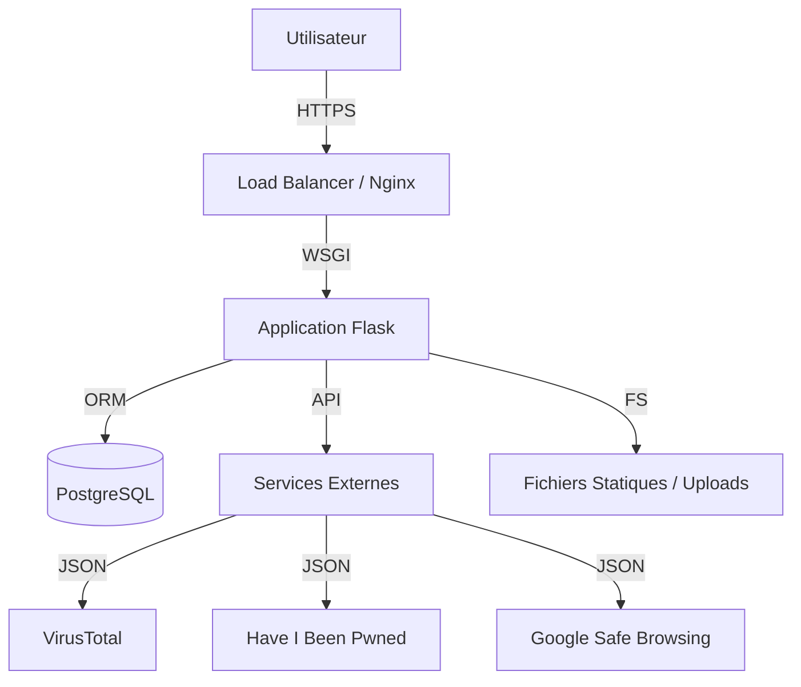

# CyberConfiance - Architecture Technique

Ce document détaille l'architecture logicielle, les flux de données et les choix technologiques de la plateforme CyberConfiance.

**Version** : 2.1
**Mise à jour** : 2025

---

## 1. Vue d'Ensemble (High-Level)

CyberConfiance suit une architecture **MVC (Modèle-Vue-Contrôleur)** classique implémentée avec **Flask**, servie par **Gunicorn** et adossée à une base de données **PostgreSQL**.



---

## 2. Stack Technologique

### 2.1. Backend (Python/Flask)
*   **Core** : `Flask 3.0`
*   **ORM** : `SQLAlchemy 3.1` (Abstraction DB) + `psycopg2-binary` (Driver PG).
*   **Migrations** : `Alembic` (Versioning du schéma).
*   **Authentification** : `Flask-Login` (Sessions, Rôles).
*   **Sécurité** : `Flask-WTF` (CSRF), `Flask-Limiter` (Rate Limiting), `Werkzeug` (Hashage).
*   **Admin** : `Flask-Admin` (Back-office CRUD).
*   **Internationalisation** : `Flask-Babel` (i18n FR/EN).

### 2.2. Frontend
*   **Langages** : HTML5 sémantique, CSS3 (Variables, Flexbox, Grid), JavaScript (Vanilla ES6+).
*   **Design System** : "Glassmorphism" personnalisé (transparence, flou, dégradés).
*   **Typographie** : Inter (Police variable).
*   **Assets** : `static/` (Images, CSS, JS).

### 2.3. Base de Données
*   **Moteur** : PostgreSQL 14+.
*   **Tables** : 18 tables relationnelles (voir section 4).

---

## 3. Structure du Projet

```bash
CyberConfiance/
├── main.py                  # Point d'entrée WSGI
├── __init__.py              # Factory Flask & Config
├── config.py                # Configuration (Env Vars)
├── models/                  # Modèles SQLAlchemy (18 fichiers)
├── routes/                  # Blueprints (Contrôleurs)
│   ├── main.py              # Routes publiques
│   ├── admin_panel.py       # Dashboard Admin
│   ├── outils.py            # Logique des outils
│   └── ...
├── services/                # Logique Métier (Business Logic)
│   ├── security/            # Orchestrateur VirusTotal/GSB
│   ├── breach/              # HIBP Service
│   ├── pdf/                 # Générateur de rapports
│   └── ...
├── templates/               # Vues Jinja2 (HTML)
├── static/                  # CSS/JS/Images
├── utils/                   # Helpers (Seed, Logs, Security)
└── docs/                    # Documentation
```

---

## 4. Schéma de Base de Données (18 Tables)

### 4.1. Utilisateurs & Sécurité
*   **`User`** : Comptes admins/mods (ID, Username, Email, PasswordHash, Role).
*   **`SecurityLog`** : Échecs de connexion, erreurs critiques.
*   **`ThreatLog`** : Menaces détectées par les outils (IP, UserAgent, Type).
*   **`ActivityLog`** : Actions administratives (Audit trail).

### 4.2. Contenu & Ressources
*   **`Rule`** : Règles de sécurité (Titre, Contenu).
*   **`Scenario`** : Scénarios d'attaque (Titre, Description, Solution).
*   **`GlossaryTerm`** : Définitions techniques.
*   **`Tool`** : Outils recommandés.
*   **`AttackType`** : Catalogue des attaques (Nom, Sévérité, Prévention).
*   **`News`** : Articles de blog/actualités.

### 4.3. Analyses & Rapports (Données Volumineuses)
*   **`SecurityAnalysis`** : Résultats scan fichiers/URLs (JSONb, Score, PDF Blob).
*   **`BreachAnalysis`** : Résultats scan HIBP (JSONb, PDF Blob).
*   **`QuizResult`** : Scores et réponses aux quiz (JSONb, PDF Blob).
*   **`QRCodeAnalysis`** : Résultats scan QR (URL, Redirects, Threat Level).
*   **`PromptAnalysis`** : Résultats analyse LLM (Prompt, Risques).
*   **`GitHubCodeAnalysis`** : Résultats audit code (Repo, Vulns, Score).
*   **`MetadataAnalysis`** : Métadonnées extraites et fichiers nettoyés.

### 4.4. Gestion des Requêtes
*   **`RequestSubmission`** : Demandes utilisateurs (Type, Statut, Message).
*   **`Contact`** : Formulaire de contact général.
*   **`Newsletter`** : Abonnés (Email, Confirmé).

### 4.5. Configuration
*   **`SiteSettings`** : Clés-valeurs pour configurer le site à chaud.
*   **`SEOMetadata`** : Titres/Descriptions par route pour le référencement.

---

## 5. Flux de Données (Data Flow)

### 5.1. Exemple : Analyse d'URL
1.  **Client** : POST `/outils/analyseur-liens` avec l'URL.
2.  **Route (`outils.py`)** : Valide l'entrée (Anti-SSRF via `utils.security_utils`).
3.  **Service (`services/security/analyzer.py`)** :
    *   Appelle `VirusTotalService.scan_url()`.
    *   Appelle `GoogleSafeBrowsing.check()`.
    *   Trace les redirections HTTP (301/302).
4.  **Base de Données** : Enregistre `SecurityAnalysis` (JSON brut + Score).
5.  **Service PDF (`services/pdf/`)** : Génère le rapport binaire si demandé.
6.  **Vue (`templates/outils/security_analyzer.html`)** : Affiche les résultats et le score coloré.

### 5.2. Exemple : Quiz
1.  **Client** : GET `/quiz` (Charge les questions JSON).
2.  **Client** : POST `/quiz` (Envoie les réponses).
3.  **Service (`services/quiz/`)** : Calcule le score (0-100%).
4.  **Session** : Stocke temporairement les résultats.
5.  **Client** : POST `/quiz/submit-email` (Optionnel).
6.  **Service (`services/breach/`)** : Vérifie l'email sur HIBP.
7.  **Base de Données** : Enregistre `QuizResult` (Score + Réponses + HIBP Summary).
8.  **Vue** : Affiche les recommandations personnalisées.

---

## 6. Sécurité & Performance

### 6.1. Sécurité
*   **CSP Nonces** : Chaque script inline a un `nonce="{{ csp_nonce }}"` unique par requête.
*   **Secure Cookies** : `HttpOnly`, `SameSite=Lax`, `Secure` (en prod).
*   **Sanitization** : Nettoyage des entrées HTML (via `bleach` ou filtres Jinja) pour prévenir les XSS stockées.
*   **SQL Injection** : Prévention native via SQLAlchemy (requêtes paramétrées).

### 6.2. Performance
*   **Lazy Loading** : Les colonnes lourdes (BLOBs PDF) sont chargées uniquement si nécessaires (`defer()`).
*   **Index Database** : Optimisation des recherches par `document_code`.
*   **Caching Static** : Headers `Cache-Control` agressifs pour les assets statiques (CSS/JS/Img).
*   **Asynchronicité** : Les scans lourds (GitHub, VirusTotal) utilisent `concurrent.futures.ThreadPoolExecutor` pour ne pas bloquer le thread principal Flask.

---

*Architecture CyberConfiance - Document Confidentiel - Usage Interne Uniquement*
